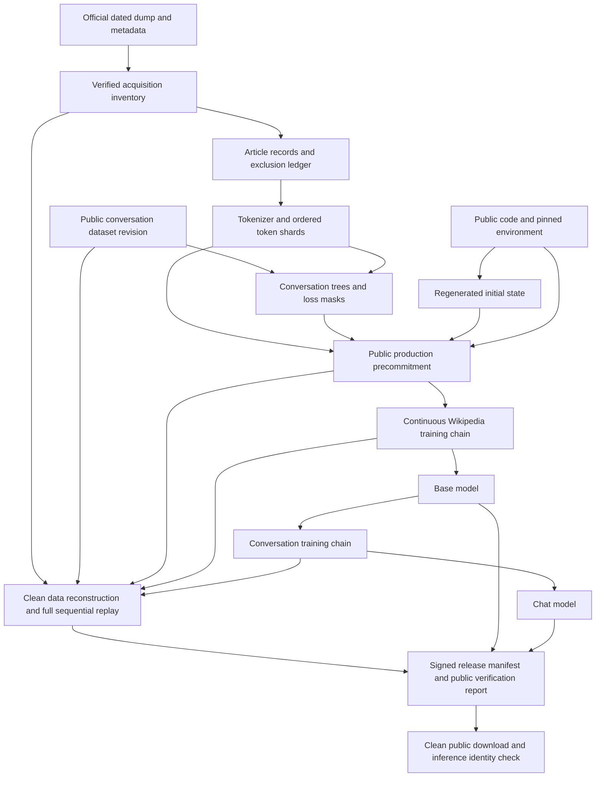

# End-to-end verifiable Wikipedia training and publication

Date: 2026-09-18. Status: design and execution specification; not completed evidence.
Private operator goals and mutable progress records are maintained locally.

## 1. What the project promises

A person who did not operate the training machine must be able to obtain the public
inputs, identify the committed code and environment, reconstruct the data and initial
state, replay the complete computation, and check that the published model is its
exact output. Every link has a named input, transformation, output, digest, check and
failure condition. Public evidence must remain usable without the trainer's secrets.

Project destinations and operating constraints:

- Source and small evidence: `https://github.com/AOSSIE-Org/OpenVerifiableLLM`.
- Models, data and large evidence: new repositories under `https://huggingface.co/AOSSIE`.
- One GPU at a time. US$130 maximum aggregate RunPod spend, including failed attempts,
  preparation, storage, full reconstruction/replay and export.
- Aim for 24 hours, but continue beyond 24 hours until fully verified if the measured
  remaining work fits the budget.
- One complete pass over the eligible article corpus from a pinned English Wikipedia
  dump, followed by training on public conversational examples; random initialization.
- No final end-to-end verified release before full reconstruction and replay pass.
  Public progress evidence and clearly labeled failed/incomplete attempts are allowed.

## 2. Trust begins with explicit assumptions

Wikipedia's public revision history is valuable, but it is not an immutable public
ledger of everything ever written. MediaWiki permits revision deletion and suppression,
including restrictions on public visibility. See [RevisionDelete](https://www.mediawiki.org/wiki/Help:RevisionDelete).
Wikimedia also explains that dumps do not provide a complete, transactionally consistent
snapshot of an entire wiki. See [what dumps are not](https://meta.wikimedia.org/wiki/Data_dumps/What_the_dumps_are_not).

Therefore the claim is **all eligible article content present in the specifically
identified dump files**, not all historical Wikipedia content, all namespaces, or a
perfect snapshot of Wikipedia at an exact instant. Later page edits do not change our
committed byte identity. Revision links help inspection; the archived source bytes
and committed digest are authoritative for this run.

| Assumption or mechanism | What it supports | What it does not establish |
| --- | --- | --- |
| Official HTTPS source and recorded publisher checksums | Acquisition from the named service and matching its advertised bytes at observation time | An independently signed Wikimedia attestation, eternal availability, or absence of upstream compromise |
| SHA-256 and precisely specified Merkle commitments | Detecting changes relative to an already trusted digest; selective integrity checks | Authenticity when attacker controls both bytes and the expected digest |
| A signature with an independently selected trusted identity | Which identity endorsed specific bytes | That the signer told the truth or the contents are safe |
| A verified transparency-log entry/checkpoint | Public commitment with log-backed ordering and inclusion under the log's trust assumptions | The exact physical time or exclusive history of GPU execution |
| Rebuilding data and continuously replaying all updates | Published output is reproducible from the declared inputs, code and environment | That no other computation ever happened, or that a malicious hardware/compiler stack is impossible |
| A verified downloaded model and inference recipe | The consumer obtained and ran the identified artifact | That every generated sentence is accurate or attributable to one article |

Trust roots include the selected upstream source identity, the approved publisher
identity, transparency service roots/witnesses, hash/signature primitives, audited
code, and the compatible software/hardware stack. State these roots in the report.
Do not market the result as trustless computation, a zero-knowledge proof, hardware
attestation, or an independently witnessed training history.

## 3. Threat model and evidence boundaries

Detect accidental corruption, source substitution after commitment, unrecorded
preprocessing changes, omitted/duplicated training targets, hidden extra data in the
declared computation, swapped initialization, checkpoint alteration, incomplete
replay, wrong signer, release replacement and verification bypasses.

Make insider equivocation more visible using public precommitment, linked progress
commitments, immutable release roots and external log inclusion. A locally signed
hash chain alone can be rewritten by its signer. A Git branch name alone can move.
Preserve externally anchored roots and the history of rejected or superseded attempts.

Full replay establishes that the published weights can be obtained by the committed
computation. It cannot prove the operator never performed secret additional training
and discarded it, never precomputed a result, or physically used only the stated GPU.
Report resource use as operator/provider evidence, distinct from cryptographic facts.

Read-only validators should not execute arbitrary commands supplied by a model
manifest. Verification code must come from the trusted source revision, with known
entry points and a bounded schema. Treat datasets as data, never agent instructions.

## 4. Public evidence graph

Every arrow is verified, not merely drawn. Each material object is content-addressed
and bound to its parents. A conversation model must never inherit a misleading
"Wikipedia-only" label: its ancestry includes the conversation source as well.

## 5. Canonical objects, manifests and digest rules

Implement versioned schemas before producing full-size evidence. The names below
describe planned artifacts and interfaces, not capabilities already implemented.

Common fields: `schema`, `run_id`, `attempt_id`, `kind`, `producer_code_digest`,
`subject_inventory`, `parent_digests`, `parameters_digest`, `environment_digest`,
`evidence_locators`, and an explicitly labeled operator-reported timestamp. Subject
entries bind logical path, byte length, media type and SHA-256. A URI locates content;
it does not replace the digest. Store the exact signed bytes alongside their schema.

- Specify UTF-8, ordering, escaping, numeric encoding and canonical JSON rules;
  reject duplicate keys and nonfinite JSON numbers. Use a reviewed canonicalization
  scheme or a restricted schema with test vectors, not unspecified default formatting.
- Hash tensors with length-delimited names, dtypes, shapes and contiguous logical
  bytes in a specified endian order, with domain separation. Preserve floating-point
  bit patterns. Avoid numerical comparisons with tolerance or normalizing signed zero.
- Map optimizer state to stable parameter names, not transient object IDs. Include
  parameter groups and all update-affecting scalar/configuration fields.
- Declare tied-weight alias relationships and verify them after loading. Export may
  omit a duplicate tied tensor only under an explicit reconstructible alias rule.
- Keep raw file hashes separate from canonical model-state and full-training-state
  hashes. Archive packaging timestamps may differ while canonical state is identical;
  consumers still verify the exact published archive bytes against the release root.
- Merkle specs must bind order, leaf count, file/record boundaries, algorithm version,
  empty inputs and odd-leaf behavior. Test proofs and roots with known vectors.
- Sign a manifest listing child digests, then store its signature separately. Never
  require a file to contain its own hash or create circular release/report dependencies.

Required object types:

| Object | Important contents |
| --- | --- |
| Source inventory | Exact dated source files, upstream checksum files and status metadata, downloaded sizes/digests, retrieval locations |
| Acquisition receipt | Requested/final URL, redirect chain, timestamps, HTTP status/selected headers, byte count, downloader version and redacted invocation |
| Corpus manifest | Extraction code/config, inclusion policy, article/revision index roots, counts, text-shard roots, exclusion/failure accounting |
| Tokenizer manifest | Sample membership/ordering and digest, training recipe/environment, special IDs, actual vocab, tokenizer files, round-trip results |
| Token-stream manifest | Token dtype/endian, shard order/ranges, target identity convention, separators/masks, total counts and Merkle roots |
| Conversation manifest | Dataset commit/files, exact split/tree/branch selection, formatter/windows/masks, token roots and complete counts |
| Environment manifest | Source commit and source-tree digest, image digest, package/build hashes, compiler/driver/runtime/GPU details, determinism settings |
| Production registration | Parents above, regenerated initial-state digest, model/optimizer/schedule, phase policy, boundary schedule, run public key and verifier policy |
| Boundary manifest | Parent registration and boundary, step/phase/cursor, consumed targets, complete state digests, checkpoint file hashes, batch-transcript root |
| Replay report | Verifier identity/version, input roots, regeneration results, every boundary comparison, supported environment, exact failures and times |
| Release manifest | All public files and evidence roots, base/chat relationship, expected trust-policy reference, replay scope and license/attribution files |

## 6. Download and source identity

1. Inspect official [English Wikipedia dump releases](https://dumps.wikimedia.org/enwiki/)
   and the relevant job-completion status. Choose a completed dated article dump.
   Record a complete file list before download. Do not combine shards from multiple
   releases or count both the monolithic and split versions as separate data.
2. Retain the exact listing, dump status and checksum files as observed. Record their
   URLs, response metadata and hashes. Verify the upstream checksums actually offered;
   do not label an unsigned checksum file as a Wikimedia cryptographic signature.
3. Download over validated HTTPS with bounded retries and resumable `.partial` files.
   Record redirects. Verify the complete final file against size, upstream checksum,
   local SHA-256 and decompression integrity before atomically promoting it to input.
   Do not assume an HTTP ETag is a cryptographic content hash.
4. Recheck the completed inventory from a separate clean verification step. Where a
   public mirror is available, compare the same release/files and record agreement
   or disagreement and who operated the check. Two URLs operated by the same party
   are not independent witnesses. A second download alone is not independent authorship.
5. Publish and anchor the source inventory before processing its bytes for production.
   Keep honest distinctions between observed source metadata, operator statements,
   externally logged digests and independently corroborated observations.
6. Preserve an obtainable raw copy for replay. Prefer both the official URL and a
   content-addressed copy in an authorized AOSSIE public data repository, subject to
   its storage limits and the source's applicable redistribution terms. Confirm
   feasibility before production; a digest of an unavailable file is insufficient.

Public receipts explain how acquisition was performed and let others compare bytes.
They do not prove an exact network transfer history to an adversary who distrusts the
collector. The stronger check is to independently acquire matching public source bytes
and reproduce the downstream computation. Publish both the receipt and that distinction.

## 7. Deterministic extraction with article-level lineage

Define the eligible corpus precisely before production: main-namespace articles,
excluding redirects, as present in the selected dump. Record rules for empty content,
non-wikitext models, malformed records and any other encountered condition. Do not
apply undisclosed quality/language/deduplication filters to satisfy a runtime budget.

The dump is consumed in a declared stable order. Each source record has page ID,
revision ID, title, namespace, revision timestamp, source file identity, record ordinal,
and raw revision-text digest. Do not invent byte offsets in compressed files; use
logical ordinals and any actual decompressed offsets with their coordinate system.

For every record write either an included-article entry or a reason-coded exclusion.
Counts must reconcile with total parsed records. An unexpected parser error aborts
preparation. Duplicate IDs, source mismatches and incomplete decompression are errors.

Freeze the wikitext-to-text policy, parser/version and treatment of links, tables,
headings, templates, references, HTML entities, Unicode and newlines. Avoid network
template expansion or fetching current pages while processing the historical dump.
If external template data is ever required, it becomes another pinned public parent.

Each article entry connects raw revision digest to extracted UTF-8 text digest,
output-shard location and length. Publish small human-readable before/after examples
selected by a reproducible rule, including difficult wikitext cases. These aid review;
they do not substitute for reconstructing every article.

Full reconstruction reruns the extractor from raw sources with a fresh output/cache
directory and reproduces the ordered article/exclusion records and text roots. Check
both bytes and accounting. The model sees extracted article text; it does not see
every markup byte in the XML dump. Make that distinction visible in the model card.

## 8. Tokenizer, token stream and exact coverage

Start with byte-level BPE, vocabulary budget 32,000 including control tokens, trained
from a deterministically selected bounded Wikipedia sample. Record the selection
function, ordered membership, tokenizer trainer build, thread settings, random state
and tie-breaking behavior. Rebuild the tokenizer twice on the fixture and again during
full reconstruction. If fitting is nondeterministic, correct the trainer/configuration
before production; saving one opaque tokenizer is insufficient for this goal.

Define escaping/special-token handling so literal marker-like text in articles cannot
silently become a control token. Verify encode/decode round trips for extracted text.
Publish the tokenizer JSON/vocab/merges, special IDs and validation vectors.

Encode the full eligible corpus into memory-mapped shards. With all IDs below 65,536,
uint16 is possible; validate this bound and store dtype and endianness explicitly.
Document BOS/EOS/document boundaries and attention boundaries. Separate padding from
genuine targets. A raw-source byte, UTF-8 extracted byte, BPE token, and trained target
are different units; all throughput reports must label their denominator.

Assign each eligible prediction target a stable global ID derived from article order
and in-article token position, plus separately enumerated declared control-token
targets. The first article token is predicted from BOS. Use input overlap where needed
so window splitting loses no target; exclude padding and duplicated context from loss.
Keep the final incomplete batch with explicit normalization. No `drop_last` behavior.

Training uses deterministic sequential traversal for the initial implementation.
Persist phase/epoch/shard/target position and any microbatch/accumulation progress.
Do not allocate a multi-billion-entry Python list to establish coverage.

Coverage proof has three parts:

1. A separate coverage validator enumerates the defined target ranges from the corpus
   index and window specification, rather than calling the trainer's batch generator.
2. Training records compact contiguous ranges and hashes of actual batch inputs,
   targets, masks and ordering into a running transcript. Batch hashes attest observed
   input identity, not that gradients were honestly computed.
3. Full replay reconstructs each batch, compares the transcript, carries state forward
   and checks boundaries. Counts/ranges show a partition of the complete target set.

Exactly one pass is about each target's contribution to optimization once in the
production Wikipedia phase. Tokenizer sampling, throughput pilots and verification
replay are separately labeled computations; pilot weights are discarded.

## 9. Public conversation data has its own complete trail

Use a pinned commit and exact data files from
[OpenAssistant/oasst1](https://huggingface.co/datasets/OpenAssistant/oasst1).
Retain its dataset card and license metadata with hashes. The current card lists an
Apache-2.0 license; preserve and recheck the actual selected revision's terms.

Reconstruct English conversation trees using a versioned policy: valid parent links,
no deleted/rejected messages, deterministic preferred assistant branch and tie-break
rules. Record the treatment of missing ranks and mixed-language trees. Every excluded
record gets a reason. Preserve the official validation split and check tree identities
do not leak across train/validation under our reconstruction.

Prepare complete short conversations and deterministic windows of longer ones.
Record all truncation/window decisions and assistant-token masks. Verify template,
role markers, BOS/EOS, prompt tokens excluded from loss, and boundaries between
conversations. Report actual message/tree/example/target counts, not an assumed 50k.

Freeze the epoch count and optimizer reset/continuation policy before this phase.
Prefer one epoch initially. If selecting among up to three epochs, preregister the
selection metric, thresholds and tie-breaks before production, record every epoch and
candidate, and include every executed update in the replay. Never silently choose an
earlier checkpoint and claim it was the last update.

The phase transition binds the exact base-model state, conversation manifest,
formatter, new optimizer state, schedule and RNG policy. Reproduce the transition
from the replayed base state, not by trusting an uploaded chat-stage start checkpoint.

## 10. Code, environment and initial state

The primary candidate is a decoder-only model with 6 layers, width 384, 6 attention
heads, tied embeddings and approximately 23M parameters at a 32k vocabulary. Start
with context 512 and dropout 0. Actual dimensions, parameter count, initialization,
optimizer, schedule and context are frozen after the pilot.

Start with BF16 autocast/FP32 master parameters; keep only configurations that pass
exact replay. Evaluate FP32 or different attention/compilation choices as needed.
Do not assume FP32, one seed, or a deterministic-algorithms flag alone establishes
exactness. PyTorch documents limits across versions and platforms in its
[reproducibility guidance](https://docs.pytorch.org/docs/2.14/notes/randomness.html).

Record the complete source revision and source-tree digest, including build scripts
and local modifications actually used; production should run a committed clean source
tree. Record dependency lock/package hashes, container digest, Python, torch, CUDA,
cuDNN/cuBLAS, driver, compiler/Triton, GPU model, device properties, relevant environment
variables, BLAS thread settings, precision/TF32 settings, attention backend and compiler
options. A container alone does not pin the host GPU driver.

Run production with immutable inputs and no dependency upgrades or opportunistic
data downloads. Separate evidence/upload access from the training process. Remove
data-fetch credentials from its environment when feasible; deny training network
access except a narrowly separated logger/uploader. Explain residual host trust.

Generate initial model and optimizer state from the declared seed and construction
order. Regenerate it in a clean process and require exact canonical equality before
registration. The initial uploaded checkpoint is a comparison target, not the source
of truth for the full replay. Verify no pretrained weights or hidden local caches were
loaded. Archive the initial state and the init transcript.

## 11. Identity, preregistration and external anchoring

Use two related identities: a short-lived run signing key for boundaries and the
approved AOSSIE release/registration identity. Store private keys outside public
artifacts. Never overwrite the repository's existing public key as a side effect of
generating a new private key. Publish run-key identity and its authorization binding.

Prefer a controlled GitHub Actions OIDC workflow to sign the production registration
and release statement, with signatures/log bundles verifiable through Sigstore. Pin
actions by commit and restrict which source refs can invoke the identity-bearing
workflow. Confirm actual permissions and signing tooling with a small public test
before the long GPU run. The signer must validate its inputs and recorded digests,
not become a service that blindly endorses arbitrary caller-provided attestations.

Verifier policy specifies allowed OIDC issuer, exact repository/workflow identity,
approved ref/source revision, run-key binding and transparency roots. Obtain that
policy from the approved project/user configuration, not from an untrusted model
directory that can select its own signer. Sigstore's
[verification guidance](https://docs.sigstore.dev/cosign/verifying/verify/)
requires selecting the expected identity and issuer.

Register two stages:

1. **Source/preparation commitment:** frozen download inventory, policy and code roots
   after acquisition and before production data preparation. Exploratory fixtures
   and pilots are explicitly distinguished from the production attempt.
2. **Production precommitment:** all final data/tokenizer roots, conversation source
   and policy, environment, code, regenerated init, exact training recipe, boundary
   schedule, verifier policy, attempt lineage and run public key before the first
   production optimizer update. The prepared-data recipe may have been developed in
   pilots; publish that history rather than imply no prior exploration.

Publish each statement, its signature and public log receipt. Verify inclusion and
signed log checkpoints under the selected log protocol; record available consistency
proofs/witness observations. Use maintained Sigstore clients rather than implementing
log cryptography from scratch. Rekor documents its public auditing role in
[the transparency-log overview](https://docs.sigstore.dev/logging/overview/).

Local timestamps do not prove preregistration. The training entry point must require
a validated production registration receipt, and the first event must bind that
receipt. This makes the declared execution auditable; it does not prove the operator
never ran an equivalent computation before registration.

Anchor linked progress at each planned durable boundary, batching only according to
the frozen policy. If anchoring is unavailable, checkpoint and pause at the boundary;
use bounded backoff and release idle compute when appropriate. Do not accumulate an
unbounded unverifiable history and pretend later uploads were contemporaneous.

## 12. Training state, checkpoints and resumability

Define an update as `S[t+1] = F(code, environment, batch[t], S[t])`. Complete state
includes named parameters/buffers; optimizer tensors, groups and counters; schedule;
all actually used RNG streams; loss-scaler state when used; phase/global step;
data cursor/order; and accumulation state. Also record training/evaluation mode and
any update-affecting auxiliary state. Inventory generators rather than assuming only
Python/NumPy/global torch exist.

Prefer durable checkpoints at completed optimizer updates with no pending gradients.
For interruption mid-update, restart from the previous committed boundary and account
for discarded work; or implement and test exact saving of gradients and accumulation
state. Never advance the data cursor past a discarded update.

Target approximately 32 production boundaries, with the exact schedule frozen from
measured target counts and the chosen effective batch size. Keep intermediate recovery
checkpoints when durable boundaries are farther than about 30 minutes apart. Only
registered boundary objects carry the release's primary chain commitments.

Each boundary binds registration root, preceding boundary digest, phase/step,
consumed-target ranges, batch transcript, complete state, artifact sizes/hashes and
run-key signature. Flush model work, write temporary files, synchronize them, compute
digests, sign, then atomically publish the completed checkpoint/manifest. Readers
reject incomplete checkpoints. Upload and verify public copies as planned.

Store checkpoints in a non-executable format: safetensors for tensors and validated
JSON for structured metadata, with documented reconstruction of RNG/optimizer state.
Avoid arbitrary pickle execution even when a checkpoint is signed. A trusted signature
authenticates its signer; it is not a guarantee that pickle content is benign.

Checkpoint/report telemetry must not perturb training RNG, schedule or data order.
Compile warmup, validation and diagnostic generation must preserve/reset relevant
state under a frozen procedure. Test these effects explicitly.

Record attempted and completed updates, finite-loss checks, throughput, checkpoint
time and cost. Failed attempts remain attributable. A changed architecture, data,
precision, optimizer or environment starts a new linked attempt and new registration;
an exact resume retains the existing attempt and records its interruption.

## 13. Full reconstruction and replay acceptance

Reserve compute for this phase before committing to production. Sampled replay is an
early diagnostic only. A final artifact checksum or matching loss curve cannot pass
this gate.

The clean verifier must:

1. Start from independently configured trust policy and the externally anchored
   registration/release roots; validate schemas, signatures, identity and parents
   before loading any state or running replay.
2. Acquire the raw source inventories, validate all bytes, and regenerate extraction,
   tokenization, token shards, conversation trees/formatting and masks in fresh output
   locations. Reuse already verified raw bytes to save transfer if desired, but do
   not trust prepared artifacts as the only inputs to reconstruction.
3. Regenerate the model and initial optimizer state from code/seed; compare boundary
   zero without loading its tensors as the initialization.
4. Replay every production Wikipedia batch/update in order from that regenerated
   state. Compare transcripts, coverage, parameters/buffers and complete relevant
   training state at each recorded boundary. Carry replay state forward.
5. Recreate the base-to-conversation transition and replay all conversation updates
   under the registered phase policy. Compare all boundaries and the selected final
   artifact if checkpoint selection was preregistered.
6. Verify that export from replayed state produces the same canonical model as the
   final exported base/chat artifacts, including tied tensors, dtypes and config.
7. Produce a detailed machine-readable report with actual tested scope, environment,
   verifier source, timestamps, first mismatch if any, and evidence digests.

Never load the prover's next opening checkpoint to recover a failing full replay;
that would conceal a broken trajectory. Segment audits that do this are reported as
segment audits. A full replay can itself resume from its own previously verified
state, with its own signed/hashed progress, so a disconnect need not waste the run.

Use the same physical GPU for production and replay when feasible. Perform the replay
in a fresh process with clean outputs and pinned code. This is an operator-performed
clean replay, not independent third-party validation. Publish instructions and costs
so a third party can reproduce it; list external validators only when they actually
exist. A second compatible machine is useful additional evidence if affordable, but
is not promised within this budget or required to pretend broad hardware portability.

The numerical stack remains a trust assumption. A CPU replay with different kernels
may not match. If exact equality fails on the declared supported configuration,
diagnose it, register a corrected attempt if needed, or report incomplete; never
quietly switch to an error tolerance.

## 14. Verification modes and fail-closed behavior

Expose separate named results, not a single ambiguous green badge:

| Mode | Minimum work | Permitted result wording |
| --- | --- | --- |
| Artifact/identity check | Download inventory, hashes, signature, trusted identity and log evidence | Artifact integrity and publisher identity verified |
| Source/preparation reconstruction | Previous checks plus raw-to-prepared regeneration | Declared corpus and data transformations reconstructed |
| Sampled segment replay | Named subset of segments replayed | These specified segments reproduced; complete trajectory not checked |
| Full end-to-end verification | Raw reconstruction, regenerated init, continuous complete replay, release mapping | Complete declared computation reproduced on the stated environment |
| Inference receipt replay | Verified model/config plus fixed input/decoding replay | This output reproduced under this inference recipe |

A consumer who checks the publisher's signed replay report has verified an attestation
of replay, not personally replayed training. Reports and CLI output must expose
`attested_by`, `performed_by` and `locally_recomputed` distinctions.

Require a nonempty coverage set and every check required for the selected profile.
Use explicit `PASS`, `FAIL`, `NOT_RUN`, `UNAVAILABLE` and `UNSUPPORTED` states. Only
all required `PASS` values satisfy that profile. Missing fields, unknown critical
schemas, unsupported backends, unavailable inputs, skipped replay and absent trusted
identity must not become overall end-to-end success. Emit actionable nonzero exits
for an unsatisfied required profile and a structured reason for each item.

Verify path confinement, sizes and hashes before parsing large files; reject path
traversal, escaping symlinks and ambiguous file inventories. Use resource limits for
untrusted inputs. No manifest-directed shell execution or remote Python imports.

## 15. Publication, retention and what an output claim means

Use the approved GitHub repository for code, schemas, tests, readable evidence index
and small manifests; use new AOSSIE Hugging Face repositories for base/chat models
and large public datasets/checkpoints. Suggested names are
`openverifiable-enwiki-<run-id>-base`, `openverifiable-enwiki-<run-id>-chat` and
`openverifiable-enwiki-<run-id>-evidence`; final names and immutable revision IDs are
recorded, not assumed. Source changes go through a branch/PR without force-pushing
or bypassing protection. Public run evidence must be retrievable at a pinned commit.

Before production, check permissions, file/repository quotas and transfer feasibility.
No unapproved paid Hugging Face plan or permanent GPU service is part of this budget.
If public retention cannot be supplied, resolve it before investing in a run whose
verification inputs would be inaccessible.

Preserve raw source copies or reliable public mirrors, complete manifests, prepared
data or fully reproducible regeneration paths, tokenizer materials, initial state,
all primary boundary states, full replay report, code/environment materials and final
weights. GitHub Actions artifacts with limited retention are not the sole public
archive. Document a target of at least 90 days of verification-input availability and
long-term retention of final models/manifests, subject to confirmed host policy.
The $130 budget does not purchase an indefinite RunPod archive.

Release the canonical FP32 parameter artifact initially if that is the verified state.
A BF16 export or quantized model is a separately hashed derived artifact with its own
conversion recipe and checks; it is not byte-identical to the parent. Do not publish
untested Ollama/Transformers compatibility claims. Provide a tested loader for the
actual architecture and a documented offline inference path.

Order publication to avoid cycles: build and verify release payload; produce a
release inventory referencing replay evidence; sign and anchor the inventory; upload
payload and inventory to a fixed revision; verify a clean public download; publish a
separate linked download-verification receipt. If anything changes, issue a new
version and new root; do not overwrite the old attestation.

The inference package binds weights, tokenizer, model configuration, chat/system
template, loader source and decoding settings. A reproducible demonstration records
input bytes/token IDs, output token IDs/text, model release root, seed, sampling
parameters and runtime. A fixed greedy example is preferable for the first demo.
Do not publish private user prompts; use public test prompts.

Three distinct consumer claims must remain separate:

- **Model provenance:** this exact downloadable model is connected to the declared
  sources and reproduced computation.
- **Response provenance:** this demonstration was produced by this model with the
  recorded inputs and decoding recipe; replay it to check.
- **Response correctness:** factual accuracy requires evaluation or source checking.
  Training provenance does not make generated statements true or supply citations.

A displayed webpage or future remote chatbot can claim to serve a model while using
another one. A signed server receipt identifies an operator's claim; local inference
replay supports output reproducibility. Hardware-attested live serving or verifiable
inference proofs would be additional projects, not implied by this training release.

Do not assert that a particular response came from a particular article merely
because training included it. Public evidence should enable source inspection;
causal attribution or retrieval-backed citations require separate methods.

## 16. Repository changes required

Existing code inspection establishes these gaps; names of new modules are proposals:

| Existing area | Gap | Planned correction |
| --- | --- | --- |
| `src/dataset.py` | Entire-text loading and random batches do not establish a full corpus pass | Streaming preparation, immutable memory-mapped shards, explicit target schedule/cursor and independent coverage checks |
| `src/artifacts.py` | Different parameter/tensor hash conventions; metadata not fully bound | Versioned metadata-aware canonical state hashes, streaming inventories, proof vectors and clear legacy compatibility |
| `src/signing.py` | Fixed key paths and signed pickle loading | Explicit run-key trust binding, no implicit key replacement, safe structured checkpoints, identity checks before use |
| `src/chain.py` | Precommitment is only an intent in comments; sampled audit compares closing parameters | Actual public registration gate, full state/batch chain, frozen precision, continuous replay from regenerated init |
| `src/publish.py` | Toy hardcoded replay recipe and starter compatibility assumptions | Recipe from actual run, full payload inventory and verified export lineage |
| `src/verifier.py` | Optional/missing replay can be skipped; signer policy comes from artifact metadata | Required profiles, trusted external identity policy, fail-closed schema/ancestry checks, full reconstruction/replay |
| Publish workflow | Tiny smoke training signed as the workflow output | Keep smoke scope explicit; add registration and real-run release workflows that check imported evidence rather than retrain the toy model |
| Documentation | Generic green output can imply more than was checked | Profile-specific claims, public trace guide, clear hardware and factual-accuracy limits |

Proposed new responsibilities: `provenance`/schema validation, `prepare_wikipedia`,
`prepare_conversations`, `token_stream`, `coverage`, `full_replay`, and `run_supervisor`.
Choose actual module boundaries during implementation; do not duplicate the numerical
training kernel in trainer and replayer. Keep coverage and manifest validation
independent enough to catch a shared batch-generator mistake.

Provide a top-level workflow with resumable stages for acquisition, preparation,
registration, training, reconstruction/replay, export and public-download checking.
Stage outputs must be validated before reuse. A file's existence is not a completed
stage. Never invent final CLI syntax in documentation before implementation tests it.

## 17. Positive, adversarial and scale checks

Start with a tiny checked-in synthetic XML fixture, clearly marked as a test rather
than Wikipedia evidence. Include redirects, non-article namespaces, empty text,
Unicode, marker-like strings, long articles, malformed input and partial final batches.
Add tiny conversation trees with missing ranks, branches and invalid parent links.

Required failure-injection matrix:

| Mutation or failure | Expected rejection |
| --- | --- |
| Change one raw byte; swap a dump shard or dated release | Source inventory/checksum mismatch before training |
| Rehash all altered local manifests without changing trusted registration | Public parent/root mismatch |
| Modify extraction output, exclusion reason, tokenizer merge or special ID | Full reconstruction mismatch |
| Omit an article or repeat one; skip final targets; shift a resumed cursor | Independent coverage/transcript/replay mismatch |
| Introduce unregistered conversation data or train on validation targets | Conversation ancestry/membership/mask mismatch |
| Load pretrained initialization or modify one initial tensor | Regenerated initial-state mismatch |
| Modify optimizer/RNG/scheduler while retaining identical weights | Full-training-state mismatch |
| Flip a checkpoint byte or substitute the run public key | Artifact/signature/key-binding failure before state loading |
| Sign with an unexpected identity and supply that identity inside the model | External trust-policy rejection |
| Remove/reorder a boundary, fork a chain, truncate events or change registration | Parent/order/anchored-root/expected-count failure |
| Omit replay, verify zero segments, skip a required check | Cannot receive the full-verification status |
| Alter weights/tokenizer/template/inference code after export | Signed release inventory mismatch |
| Craft executable pickle, path traversal or symlink escape | Rejected without arbitrary code execution or out-of-root reads |
| Interrupt download, checkpoint write, replay or upload | Resume from verified completed objects; no false completion |
| Disk full, nonfinite loss, exhausted budget or missing external anchor | Checkpoint/abort appropriately, preserve evidence, stop avoidable billing |

Also test regeneration twice, uninterrupted versus resumed training, final short
accumulation groups, sampling RNG isolation, cache-independent rebuilds, and correct
inference after a clean export/download. Test canonicalization with independent
vectors, including dtype/shape/name changes and ties.

On GPU, require the selected real configuration to pass fresh-process replay before
production. Benchmark representative actual data, loss masks, logging, hashing and
checkpoint I/O. Measure memory/disk on enough shards to validate bounded resource use.
Run existing regressions. Add tests for trust/coverage behavior, not meaningless
assertions that merely restate implementation constants.

## 18. Execution phases and gates

| Phase | Work | Exit gate |
| --- | --- | --- |
| P0 | Inspect current code/state; implement schemas, canonical digests, safe state and tiny fixtures | Fixtures demonstrate acquisition-to-export lineage and reject broken links |
| P1 | Build full-data extractor, tokenizer, coverage, chat preparation and complete-state trainer/replayer | Deterministic local regeneration/resume tests; regression checks pass |
| P2 | Implement trust policy, public registration/log client, release verifier and cost supervisor | Small test commitments verified; required checks cannot be skipped to success; resource guards tested |
| P3 | Check access/quotas, select dated sources, establish public source commitment, prepare full data | Exact source/data counts and roots, public availability, reproducible preparation recipe |
| P4 | Provision one GPU, benchmark candidate, verify exact resume, compute forecast | Full training plus reconstruction/replay/export fits remaining budget with margin |
| P5 | Freeze final recipe/environment/init and public production registration | Verified receipt and complete parent graph before any production optimizer update |
| P6 | Train complete Wikipedia pass and conversation phase; anchor boundaries | Exact target coverage; durable publicly bound base/chat checkpoints |
| P7 | Clean reconstruction and full sequential replay | All data/init/boundary/final-state comparisons pass |
| P8 | Export, sign, publish, clean-download verify and demonstrate inference | Complete release identity and public evidence availability checked |
| P9 | Teardown, cost reconciliation, final report | G01–G10 evidence complete, compute terminated and residual storage owned/accounted |

Preparation may overlap local implementation only if all production artifacts are
regenerated under the final registered recipe. Code changes after registration create
a new attempt. Avoid GPU rental while waiting for source code, credentials, public
signing setup or human input. Preserve a useful local package even if an external
account is temporarily unavailable.

## 19. Compute, cost and feasibility

Use the RunPod batch-job workflow: official compatible PyTorch template, persistent
checkpoint storage, detached process, no public inference service ports, logs and
checkpoints on persistent storage, real checks, bounded lifetime and verified teardown.
Check availability before buying a location-bound volume. Recheck live prices; the
previously observed RTX 5090 price of $0.99/hour is a planning reference only.

Implementation decision, 2026-09-18: durable off-pod archives may supply checkpoint
persistence instead of the provisionally proposed location-bound network volume.
Every public primary checkpoint must be uploaded, freshly downloaded and verified
before its acknowledgement permits further updates. Preserve recovery checkpoints
off-pod before teardown; account for export time, interrupted transfers, grace and
retained storage in the forecast. A pod-local file or an asserted export timestamp
does not satisfy this requirement. This changes storage placement only: complete
checkpoint retention, replay, reserve and termination gates still apply. Actual
export/shutdown integration must pass before this placement admits production.

Inspect local free space and CPU before full download. Remote preprocessing, duplicate
prepared outputs during reconstruction, immutable checkpoint retention, public uploads
and replay all consume time and storage. Plan 250–500 GB provisionally; calculate
required space from actual objects and retention schedule with at least 20% headroom.
Validate that public archive quotas can hold required evidence before training.

Initial allowances are $10 preparation/pilot, $25 training/evaluation/export, $25 full
verification, $5 temporary storage and $35 reserve. Reallocate within the same hard
cap based on measured data; the reserve is not additional credit. Full preparation
reconstruction and public anchoring overhead were absent from the earliest estimates
and must now be measured. The old 19–41-hour estimate is not a commitment for this
stronger specification.

Measure sustained useful targets/sec over at least 10 minutes after warmup, including
normal logging and representative checkpoint costs. Estimate separately:

`remaining_cost = preparation + training + conversation + reconstruction + full_replay + export + storage + 25% runtime margin`

Use actual corpus target counts, configuration-specific measured speed, quoted rates,
remaining steps, and paid elapsed time. Avoid double-counting checkpoint overhead or
excluding it entirely. Record forecasts and later compare them to actuals. The
external 185k-token/s comparison is context, not our throughput measurement.

Before production, projected total must fit below the $120 operating threshold with
room for the reserved final $10. Stop new compute at the earlier safe threshold if
remaining mandatory verification no longer fits. The revised guard policy is:
set `terminateAfter`, maintain a persistent external watchdog, and explicitly
terminate a still-running pod at deadline + 120 seconds. Verify termination with
fresh provider observations and reconcile actual charges including the grace period.
Provider automatic termination remains UNVERIFIED. Budget the grace period and
billing slack before choosing the deadline, with an earlier graceful checkpoint
trigger. Monitoring must survive agent/client disconnect; do not wait for support.
Personal authorization records are retained privately. Public evidence records
the technical policy and actual observations, not the underlying conversation.

Track all project-created pods, CPU resources, disks and volumes across attempts.
Do not assume the account's entire balance is available if other workloads spend it;
do not terminate unrelated resources. Never purchase credits or enable auto-top-up.
If no compliant configuration fits, publish the measured feasibility result and
preserve work; do not spend the last funds merely to produce an unverifiable model.

## 20. Operational recovery requirements

Recover the actual local and remote state before advancing an interrupted attempt.
Adopt an existing resource by its recorded identity; do not provision a duplicate.
Only one controller may advance an attempt. Use leases and idempotent transitions.
Keep mutable operational notes private and separate from public technical evidence.
Public exports must be explicitly selected and reviewed; working directories and
personal or AI-agent interactions are not publication inputs.

When a gate fails, record the cause and evidence; repair and rerun the affected checks.
Keep successful unrelated work. If correction changes registered inputs or behavior,
start a linked attempt and preserve the old result. Bound retries by remaining budget
and useful diagnostic progress. Never edit historical reports to change a failure
into a pass.

Detached jobs and budget guards must survive loss of an interactive session.
Claim monitoring only when its mechanism is installed and tested.

Before a genuine blocker ends active execution, checkpoint, sync evidence, avoid idle
GPU charges, record exact restart instructions, and identify any residual storage
billing. Never delete the only copy of artifacts. Once off-pod public/private backups
are verified, terminate compute and remove temporary volumes only under the documented
retention/cleanup policy.

## 21. Final evidence presentation

Deliver a human-readable public trace page with one row per stage:
input identity -> operation/code -> output identity -> verification result -> evidence
link. Include source and dataset lineage, configuration, chronology supported by
public commitments, all failed/superseded attempts, coverage, exact replay results,
export mapping and clean download receipt. Let readers inspect raw manifests beneath
the summary. No green status without a corresponding passed check and its scope.

Provide working commands for quick artifact verification, full data reconstruction,
sampled replay, complete replay and inference reproduction, each with measured costs,
expected environment and expected result structure. Make expensive operations opt-in
and disclose their resource needs. Quick verification must not silently launch hours
of GPU training or claim to have done so.

Report base and chat evaluation separately. Wikipedia loss is training loss because
every eligible article was included. Conversation validation remains held out.
Publish representative failures as well as successes. Verifiability and model quality
are separate results; neither substitutes for the other.

Completion requires every G01–G10 condition in the goal to be satisfied with actual
locators and digests, no required `NOT_RUN` checks, downloadable public evidence,
published verified artifacts, real cost/runtime figures and confirmed compute teardown.
If the project cannot complete within $130, the correct deliverable is a truthful
partial status and preserved evidence, not a weakened definition of verification.
